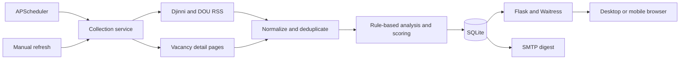

# VacancyTool

A self-hosted job vacancy aggregator that collects openings from Djinni and DOU, normalizes and deduplicates them, assigns a deterministic relevance score, and presents the results in a responsive web dashboard.

The application is designed to run continuously on a personal computer. It polls configured RSS searches on a time-aware schedule, opens individual vacancy pages to retrieve full descriptions, stores everything in SQLite, and sends an email digest when relevant new vacancies appear.

## Highlights

- Multiple searches per source with independent URLs and configuration
- Extensible source adapters for RSS parsing and vacancy detail extraction
- Cross-source normalization and conservative deduplication
- Deterministic scoring from `0` to `100`, with an explanation saved for every result
- Automatic exclusion of QA, Project Manager, UI/UX Designer, and Customer Support roles
- Persistent workflow statuses: `New`, `Interested`, `Applied`, `Viewed`, `Postponed`, `Rejected`, `Deleted`, and `Irrelevant`
- Combined status and score filters with immediate status updates
- Dynamic polling intervals based on the time of day
- Email digests for new vacancies scoring above `25`
- Optional private phone access through Tailscale Serve
- Responsive interface for desktop and mobile browsers

## Architecture



The Flask layer handles presentation and status updates. Collection, scoring, persistence, and notifications remain separate modules, so another source or a future AI scoring provider can be added without changing the web interface.

## Technology

- Python 3.10+
- Flask and Waitress
- APScheduler
- SQLite
- feedparser, Requests, and Beautiful Soup
- Vanilla JavaScript and CSS
- `unittest`

## Quick start

```sh
git clone https://github.com/dmytro-rusin/VacancyTool.git
cd VacancyTool
python3 -m venv .venv
.venv/bin/pip install -r requirements.txt
.venv/bin/python -m vacancytool
```

Open [http://127.0.0.1:5090](http://127.0.0.1:5090).

On first launch, the application creates `settings.json` and `vacancies.sqlite3`. The first collection starts immediately. Both files, along with logs and credentials, are excluded from Git.

## Configuration

### Searches and schedule

Edit the schedule in the web interface or update the generated `settings.json`. Each search has a source, display name, URL, and enabled flag. The default configuration includes iOS and Mobile searches for both Djinni and DOU.

The default schedule uses the `Europe/Kyiv` time zone:

| Time | Interval |
| --- | ---: |
| 07:00–12:00 | 10 minutes |
| 12:00–16:00 | 15 minutes |
| 16:00–20:00 | 10 minutes |
| 20:00–07:00 | 30 minutes |

A manual refresh does not reset or shift the automatic schedule.

### Email notifications

Copy `mail.example.json` to `mail.json`, enter the SMTP settings, and restrict the file permissions:

```sh
cp mail.example.json mail.json
chmod 600 mail.json
```

For Gmail on macOS, `./scripts/configure_gmail.sh` securely prompts for a 16-character App Password without placing it in shell history. The application also supports reading the password from macOS Keychain through `keychain_service`.

New vacancies with a score strictly above `25` are sent in one digest, ordered by score. After successful delivery, their status changes from `New` to `Viewed`, preventing repeated notifications.

### Private phone access

The server binds only to `127.0.0.1:5090`. For private remote access, use [Tailscale Serve](https://tailscale.com/docs/features/tailscale-serve), copy `access.example.json` to `access.json`, and enter the exact `*.ts.net` hostname.

The intended setup keeps Funnel disabled and limits port `443` to the owner's phone through a Tailscale grant. VacancyTool validates the incoming Host and the Origin of state-changing requests as an additional boundary.

### Run continuously on macOS

The `launchd` directory contains a LaunchAgent template. Replace every `__PROJECT_DIR__` placeholder with the absolute clone path, adjust the label if desired, copy the file to `~/Library/LaunchAgents`, and load it with `launchctl`.

The Mac must remain powered on, signed in, connected to the network, and awake. The display may be off.

## Scoring

The current implementation is deterministic and deliberately explainable. It classifies the role, seniority, and stack from the title and description, then uses the following priority order:

1. Native iOS
2. Native iOS + Android
3. KMP
4. Flutter
5. React Native
6. Python backend
7. Go backend
8. Java backend
9. JavaScript
10. C++

Seniority preference varies by category. For example, native iOS prioritizes Senior, while backend prioritizes Junior and cross-platform mobile prioritizes Middle. Hybrid, Onsite, and Office-only vacancies receive a five-point penalty when no Remote option is available. Scores never fall below zero.

Salary is neither modeled nor displayed. Compensation fragments are removed from stored titles and descriptions where possible.

## Ordering and workflow

Vacancies are ordered by:

1. Status: `New → Interested → Applied → Viewed → Postponed → Rejected → Deleted → Irrelevant`
2. Score, highest first
3. Publication date, newest first

Records are retained even when they become irrelevant or deleted. A missing item in a short RSS feed is not treated as proof that the original vacancy was removed.

## Tests

```sh
.venv/bin/python -m unittest discover -s tests -v
```

The test suite covers scoring and workplace penalties, exclusions, normalization, cross-source behavior, sorting, schedule boundaries, mail queue semantics, and the web security checks.

## Project structure

```text
vacancytool/
  database.py       SQLite schema, migrations, queries, and deduplication
  scoring.py        role classification and relevance scoring
  service.py        collection orchestration and scheduling
  sources.py        RSS and vacancy detail adapters
  notifications.py SMTP digest delivery
  web.py            Flask routes and request validation
static/              responsive CSS and browser behavior
templates/           Jinja templates
tests/               unit and integration tests
scripts/             local configuration helpers
launchd/             macOS LaunchAgent template
```

## Current limitations

- Source HTML changes can require parser updates.
- Deleted vacancies are currently marked manually.
- Scoring is rule based; an AI-assisted analysis layer is planned as a separate provider.
- This is a single-user application. Remote access relies on the surrounding Tailscale identity and access policy.
